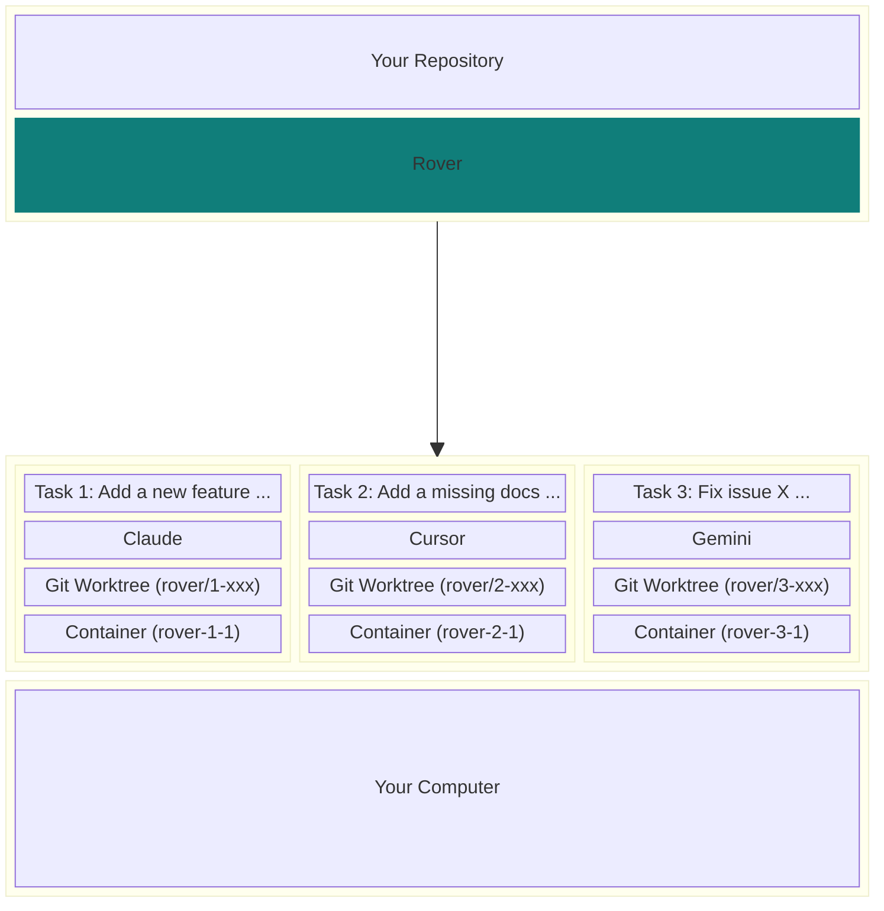

<div align="center">
  <a href="https://endor.dev/rover">
    <picture>
      <source media="(prefers-color-scheme: dark)" srcset="https://github.com/user-attachments/assets/d53e2e6d-2dac-4999-b1c9-63961035ffd9">
      
    </picture>
  </a>
  <h1>Rover</h1>

<a href="https://endor.dev"></a>
<a href="https://www.npmjs.com/package/@endorhq/rover"></a>
<a href="https://github.com/endorhq/rover/blob/main/license.md"></a>
<a href="https://discord.gg/ruMJaQqVKa"></a>

</div>

Rover is a **manager for AI coding agents that works with Claude Code, Codex, Cursor, Gemini, and Qwen**.

It helps you get more done, faster, by allowing **multiple agents to work on your codebase simultaneously**. The agents work in the background in separate, isolated environments: they don't interfere with your work or each other.

**Rover does not change how you work**: everything runs locally, under your control, and using your already installed tools.

## Getting Started

First, install Rover:

```sh
npm install -g @endorhq/rover@latest
```

Then, run `rover task` in your project to create a task describing what you want to accomplish and hand it to Rover. You can specify which agent to use with the `--agent` (or `-a`) flag. Rover will automatically detect your project and register it.

Supported agents: `claude`, `codex`, `cursor`, `gemini`, and `qwen`.


Rover will:

- 🔒 Prepare a **local isolated environment** (using containers) with an independent copy of your project code
- ⚙️ **Install and configure** your preferred AI coding agent in that environment
- 🤖 Setup a workflow for the agent to complete the task and **run it in the background until it finishes**
- 📖 Collect a set of **developer-friendly documents** with information about the changes in the code

Depending on the task complexity, it might take a few minutes. Meanwhile, you **can create new tasks and run them in parallel** or simply relax, step back and do some other work, whether on your computer or away from it!

## Why Rover?

Running and managing multiple AI coding agents simultaneously can be overwhelming. You need to run them isolated from each other and they constantly ask for attention. **Context switching quickly becomes a productivity drain**.

At the same time, **parallel execution is one of the most powerful capabilities of AI coding agents**. You can focus on a task while a team of agents complete small issues, start another task, or just write some documentation.

To simplify this process, **Rover manages AI coding agents on your behalf**. It integrates with both your terminal and VSCode (as an extension).



### Main features

- 🚀 **Easy to use**: Manage multiple AI coding agents working on different tasks with a single command
- 🔒 **Isolated**: Prevent AI Agents from overriding your changes, accessing private information or deleting system files
- 🤖 **Bring your AI agents**: Use your existing AI agents like Claude Code, Codex, Cursor, Gemini, and Qwen. **No new subscriptions needed**
- 💻 **Local**: Everything runs on your computer. No new apps and permissions in your repositories
- 👐 **Open Source**: Released under the Apache 2 license

## Quickstart

### Prerequisites

- [Node.js 22+](https://nodejs.org/en/download)
- [Git](https://git-scm.com/downloads)
- [Docker](https://docs.docker.com/engine/install/) or [Podman](https://podman.io/docs/installation)

You need at least one supported AI agent in your system:

- [Claude Code](https://docs.anthropic.com/en/docs/claude-code/setup)
- [Codex](https://github.com/openai/codex?tab=readme-ov-file#installing-and-running-codex-cli)
- [Cursor](https://docs.cursor.com/cli)
- [Gemini CLI](https://github.com/google-gemini/gemini-cli?tab=readme-ov-file#-installation)
- [Qwen Code](https://github.com/QwenLM/qwen-code?tab=readme-ov-file#installation)

### Installation

- [Terminal](#terminal)
- [VSCode](#vscode)

#### Terminal

Install it using `npm`:

```sh
npm install -g @endorhq/rover@latest
```

### First steps

1. Create your first task with Rover:

   ```sh
   cd <your-project> && rover task --agent claude
   ```

2. Check the status of your task:

   ```sh
   rover ls -w
   ```

3. Keep working on your own tasks 🤓

4. After finishing, check the task result:

   ```sh
   rover inspect 1
   rover inspect 1 --file changes.md
   rover diff 1
   ```

5. If you want to apply more changes, create a second iteration with new instructions:

   ```sh
   rover iterate 1
   ```

6. If you need to apply changes manually, jump into the task workspace:

   ```sh
   rover shell 1
   ```

7. If changes are fine, you can:
   - Merge them:

   ```sh
   rover merge 1
   ```

   - Push the branch to the remote using your git configuration:

   ```sh
   rover push 1
   ```

   - Take manual control:

   ```sh
   rover shell 1
   git status
   ```

> 💡 TIP: You can run multiple tasks in parallel. Just take into account your AI agents' limits.

#### Configuration

Although it's not required, we recommend running `rover init` in your project to generate an initial configuration:

```sh
rover init
```

#### VSCode

Rover is available on the [VSCode Marketplace](https://marketplace.visualstudio.com/vscode). You can look for `Rover` in your VSCode Extensions Panel or access the [Marketplace page](https://marketplace.visualstudio.com/items?itemName=endorhq.rover) and click `Install` there.

If the Rover CLI is not in the `PATH`, the extension will guide you through the setup process. Once everything is ready, you will be able to create your first task!

See the [VSCode documentation site](https://docs.endor.dev/rover/vscode-extension/).

## How it works

**Rover relies on local tools you already have like Git, Docker/Podman and AI coding agents**. When you create your first task in a project, Rover automatically detects your project setup, identifies its requirements, and registers it in a central store.

Once you create a task, Rover creates a separate _git worktree_ (`workspace`) and branch for that task. It starts a container, mounts the required files, installs tools, configures them, and lets your AI agent complete a workflow. Rover workflows are a set of predefined steps for AI coding agents. Depending on the workflow, you might get a set of changes in the workspace or a document with research.

After an AI agent finishes the task, all code changes and output documents are available in the task workspace (_git worktree_). You can inspect those documents, check changes, iterate with an AI agent, or even take full control and start applying changes manually. **Every developer has a different workflow, and Rover won't interfere with it**.

Once you are ready, you can merge changes or push the branch. That's it! 🚀

### Model Selection

Rover supports selecting both the AI agent and the model using the `agent:model` syntax:

```sh
rover task -a claude:sonnet    # Use Claude with Sonnet model
rover task -a claude:opus      # Use Claude with Opus model
rover task -a gemini:pro       # Use Gemini with Pro model
```

You can also configure default models per agent in `.rover/settings.json`:

```json
{
  "defaults": {
    "models": {
      "claude": "sonnet",
      "gemini": "flash"
    }
  }
}
```

### Multi-Project Support

Rover supports managing tasks across multiple projects. Use the `--project` flag or the `ROVER_PROJECT` environment variable to target a specific project:

```sh
rover ls --project my-project
rover task --project /path/to/project
```

To view all registered projects and their tasks:

```sh
rover info
```

### MCP Server

Rover can run as a [Model Context Protocol](https://modelcontextprotocol.io/) (MCP) server, allowing AI assistants to interact with Rover programmatically:

```sh
rover mcp
```

This exposes all core Rover commands (task creation, inspection, logs, diff, merge, push, etc.) as MCP tools. You can configure it in your AI agent's MCP settings:

```json
{
  "mcpServers": {
    "rover": {
      "command": "rover",
      "args": ["mcp"]
    }
  }
}
```

### Workflow Management

Rover ships with built-in workflows and supports adding custom ones. Use the `workflow` commands to manage them:

```sh
rover workflow list                       # List available workflows
rover workflow add <url-or-path>          # Add a custom workflow
rover workflow inspect <workflow-name>    # Inspect a workflow definition
```

### Network Configuration

Control network access for task containers using allowlist or blocklist rules in `rover.json`:

```json
{
  "sandbox": {
    "network": {
      "mode": "allowlist",
      "allowDns": true,
      "allowLocalhost": true,
      "rules": [
        { "host": "github.com", "description": "Allow GitHub access" },
        { "host": "registry.npmjs.org", "description": "Allow npm registry" }
      ]
    }
  }
}
```

**Available modes:**
- `allowall` (default) - No network restrictions
- `allowlist` - Block all traffic except specified hosts
- `blocklist` - Allow all traffic except specified hosts

Rules support domain names, IP addresses, and CIDR notation.

### Sandbox Configuration

Customize the container sandbox environment in `rover.json`:

```json
{
  "sandbox": {
    "agentImage": "custom-agent-image:latest",
    "initScript": "./scripts/setup.sh",
    "extraArgs": ["--gpus", "all"]
  },
  "envs": ["API_KEY", "DATABASE_URL"],
  "envsFile": ".env.rover",
  "excludePatterns": ["node_modules/**", "dist/**"]
}
```

| Option | Description |
|--------|-------------|
| `sandbox.agentImage` | Custom Docker/Podman image for the agent container |
| `sandbox.initScript` | Script to run during container initialization |
| `sandbox.extraArgs` | Extra arguments passed to the container runtime |
| `envs` | Environment variables to forward into the container |
| `envsFile` | Path to an env file to load into the container |
| `excludePatterns` | Glob patterns for files to exclude from the agent's context |

### Task Lifecycle Hooks

Rover supports hooks that run shell commands when task lifecycle events occur. Configure hooks in your `rover.json`:

```json
{
  "hooks": {
    "onComplete": ["./scripts/on-complete.sh"],
    "onMerge": ["./scripts/on-merge.sh"],
    "onPush": ["echo 'Task $ROVER_TASK_ID pushed'"]
  }
}
```

**Available hooks:**
- `onComplete` - Runs when a task completes (success or failure), detected via `rover list` or `rover list --watch`
- `onMerge` - Runs after a task is successfully merged via `rover merge`
- `onPush` - Runs after a task branch is pushed via `rover push`

**Environment variables** passed to hook commands:
| Variable | Description |
|----------|-------------|
| `ROVER_TASK_ID` | The task ID |
| `ROVER_TASK_BRANCH` | The task branch name |
| `ROVER_TASK_TITLE` | The task title |
| `ROVER_TASK_STATUS` | Task status: "completed" or "failed" (onComplete only) |

**Example hook script** (`scripts/on-complete.sh`):
```bash
#!/bin/bash
echo "Task $ROVER_TASK_ID ($ROVER_TASK_TITLE) finished with status: $ROVER_TASK_STATUS"
# Notify your team, trigger CI, update a dashboard, etc.
```

Hook failures are logged as warnings but do not block operations.

### Telemetry

Rover collects anonymous usage telemetry to help improve the product. No code, task content, or personal information is collected.

**Data collected:**
- Anonymous user ID (random UUID)
- Command usage (which commands are run)
- Agent and workflow names used
- Source (CLI or extension)

**To disable telemetry:**

```bash
# Option 1: Environment variable
export ROVER_NO_TELEMETRY=1

# Option 2: Create marker file
touch ~/.config/rover/.no-telemetry
```

### Report Issues

Found a bug or have a feature request? Please [open an issue on GitHub](https://github.com/endorhq/rover/issues). We appreciate detailed bug reports and thoughtful feature suggestions.

### Join the Community

We'd love to hear from you! Whether you have questions, feedback, or want to share what you're building with Rover, there are multiple ways to connect.

- **Discord**: [Join our Discord spaceship](https://discord.gg/ruMJaQqVKa) for real-time discussions and help
- **Twitter/X**: Follow us [@EndorHQ](https://twitter.com/EndorHQ) for updates and announcements
- **Mastodon**: Find us at [@EndorHQ@mastodon.social](https://mastodon.social/@EndorHQ)
- **Bluesky**: Follow [@endorhq.bsky.social](https://bsky.app/profile/endorhq.bsky.social)

## License

Rover is open source software licensed under the Apache 2.0 License.

---

<div align="center">

**Built with ❤️ by the Endor team**

_We build tools to make AI coding agents better_

</div>
